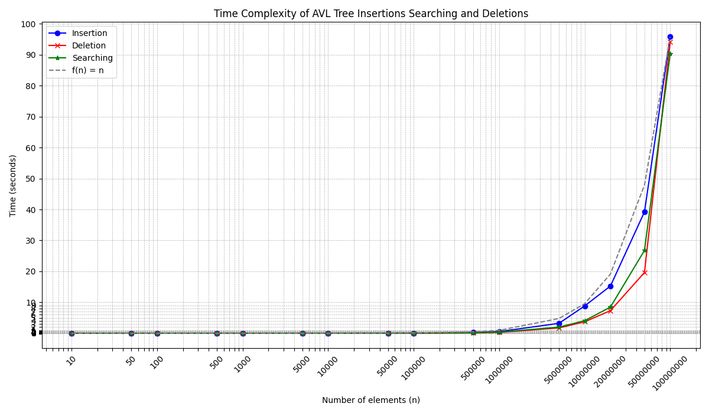
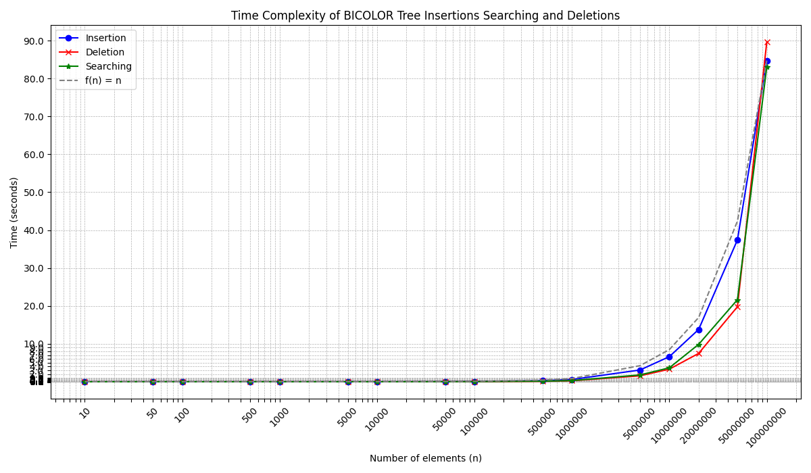

# Comparing Tree Structures: AVL vs Red-Black Trees

A C project comparing the performance of two self-balancing binary search tree implementations: AVL trees and Red-Black trees.

## Overview

This project implements and benchmarks two balanced tree data structures:
- **AVL Trees**: Strictly balanced trees using balance factors
- **Red-Black Trees**: Loosely balanced trees using color properties

The comparison focuses on three fundamental operations:
- **Insertion**: Adding elements to the tree
- **Search**: Finding elements in the tree
- **Deletion**: Removing elements from the tree

## Project Structure

```
.
├── include/
│   ├── avl-tree.h           # AVL tree interface
│   ├── bicolor-tree.h       # Red-Black tree interface
│   ├── test.h               # Testing utilities
│   └── min-max.h            # Helper macros
├── src/
│   ├── avl/
│   │   └── avl-tree.c       # AVL tree implementation
│   ├── bicolor/
│   │   └── bicolor-tree.c   # Red-Black tree implementation
│   └── plot_results.py      # Results visualization script
├── tests/
│   ├── test-avl-tree.c      # AVL tree tests
│   ├── test-bicolor-tree.c  # Red-Black tree tests
│   └── test_utils.c         # Testing utilities
├── CMakeLists.txt
└── README.md
```

## Requirements

- **Compiler**: GCC (C99 standard)
- **Build system**: CMake 3.21 or higher
- **Python 3**: For plotting results (with matplotlib, pandas, numpy)
- **OS**: Linux (tested) or Windows (with adaptations)

### Installing Python Dependencies

```bash
pip install matplotlib pandas numpy
```

## Building the Project

### Using CMake Presets (Linux)

```bash
# Configure and build (Debug mode)
cmake --preset linux-debug
cmake --build --preset debug

# Or for Release mode
cmake --preset linux-release
cmake --build --preset release
```

### Manual Build

```bash
# Create build directory
mkdir -p build && cd build

# Configure
cmake ..

# Build
make

# Run tests
ctest
```

## Running the Tests

### Run All Tests

```bash
cd build
ctest --output-on-failure
```

### Run Individual Tests

```bash
# AVL tree tests
./tests/test-avl-tree

# Red-Black tree tests
./tests/test-bicolor-tree
```

## Test Coverage

The project includes two types of tests for each tree structure:

### 1. Performance Tests (Integer Data)

Tests are run on incrementally larger datasets:
- 10, 50, 100, 500, 1,000, 5,000, 10,000, 50,000, 100,000, 500,000, 1,000,000, 5,000,000, 10,000,000, 20,000,000, 50,000,000, 100,000,000 elements

For each dataset size, the following operations are measured:
- Insertion time
- Search time
- Deletion time

### 2. Functional Tests (Dictionary Data)

Tests with a custom `Hashmap` structure containing word-definition pairs:
- Insertion of multiple entries
- Tree visualization with balance/color information
- Deletion of specific entries
- Tree structure verification

## Results

After running the tests, results are saved in the `result/` directory:

```
result/
├── results_avl.csv          # AVL tree benchmark data
├── results_bicolor.csv      # Red-Black tree benchmark data
├── time_complexity of_avl.png       # AVL visualization
└── time_complexity of_bicolor.png   # Red-Black visualization
```

### Interpreting the Graphs

The generated plots show:
- **Blue line**: Insertion time
- **Red line**: Deletion time
- **Green line**: Search time
- **Gray dashed line**: Linear reference f(n) = n

Both axes use logarithmic scales to better visualize performance across different magnitudes.

## Key Features

### AVL Trees
- Strictly balanced (height difference ≤ 1)
- Uses integer balance factors
- Single and double rotations
- Faster lookups due to stricter balancing

### Red-Black Trees
- Loosely balanced (longest path ≤ 2× shortest path)
- Uses node colors (RED/BLACK)
- Maintains 5 red-black properties
- Faster insertions/deletions due to fewer rotations

### Common Operations
- `tree_new()`: Create empty tree
- `tree_insert_sorted()`: Insert with automatic balancing
- `tree_search()`: Find element
- `node_delete()`: Remove element with rebalancing
- `tree_delete()`: Destroy entire tree
- Traversal: pre-order, in-order, post-order
- Utility: `tree_height()`, `tree_size()`

## Implementation Details

### AVL Tree Balancing
- Balance factor = left_height - right_height
- Triggers rotation when |balance| > 1
- Four rotation cases: LL, RR, LR, RL

### Red-Black Tree Properties
1. Every node is RED or BLACK
2. Root is BLACK
3. All leaves (NULL) are BLACK
4. RED nodes have BLACK children
5. All paths from root to leaves contain the same number of BLACK nodes

## Performance Analysis

Both trees guarantee **O(log n)** time complexity for all operations:
- Insertion: O(log n)
- Search: O(log n)
- Deletion: O(log n)

**Expected observations**:
- AVL trees: slightly faster searches (stricter balance)
- Red-Black trees: slightly faster insertions/deletions (fewer rotations)
- Both significantly outperform unbalanced BSTs
- Both scale logarithmically (much better than linear f(n) = n)

**Actual observations**
**AVL Tree Performance:**



**Red-Black Tree Performance:**



- As shown in the charts, both trees offer similar overall performance.
  The main difference is that AVL trees perform significantly more rotations, which slightly increases insertion and deletion time.

## Authors
| <a href="https://gitlab.univ-lr.fr/nchamoua">  </a> | **name :** Noam Chamouard <br> **GitLab :** [mon profil](https://gitlab.univ-lr.fr/nchamoua) |
| :--------------------------------------------------------------------------------------------------------------------------------------------------------------------: | :-----------------------------------------------------------------------------------------: |

| <a href="https://gitlab.univ-lr.fr/acvjetic">  </a> | **name :** Axel Cvjetic <br> **GitLab :** [mon profil](https://gitlab.univ-lr.fr/acvjetic) |
| :--------------------------------------------------------------------------------------------------------------------------------------------------------------------: | :---------------------------------------------------------------------------------------: |

| <a href="https://gitlab.univ-lr.fr/dollivie">  </a> | **name :** Dimitri Ollivier <br> **GitLab :** [mon profil](https://gitlab.univ-lr.fr/dollivie) |
| :--------------------------------------------------------------------------------------------------------------------------------------------------------------------: | :-------------------------------------------------------------------------------------------: |